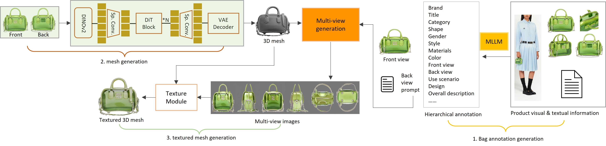

# Bag3D: Training-Free 3D Bag Generation from Dual-View Images and Structured Attributes
### 

  

## Overview

This repository presents **Bag3D**, a training-free framework for generating
textured 3D bag models from a **front–back image pair** and **structured
multimodal product attributes**.

Unlike conventional image-to-3D approaches that require extensive training
or 3D supervision, Bag3D operates entirely without additional learning or
finetuning. By explicitly reasoning over complementary front and back views
and leveraging rich multimodal semantics commonly available in online retail
platforms, Bag3D enables accurate shape recovery and realistic texture
synthesis even for previously unseen viewpoints.

---

## Method

  

Bag3D consists of three key stages:

1. **View-Aware Multimodal Annotation**  
   A multimodal large language model is used to extract hierarchical,
   view-aware annotations from input images and textual metadata,
   explicitly distinguishing front- and back-view characteristics.

2. **Dual-View Mesh Reconstruction**  
   Geometric cues from the front and back images are fused through a
   dual-view reconstruction pipeline, enabling more complete and
   consistent 3D geometry recovery.

3. **Texture Synthesis and Integration**  
   Multi-view images are synthesized conditioned on the reconstructed mesh
   and textual prompts, and integrated into a unified texture map via
   incidence-aware blending and targeted inpainting.

The entire pipeline is **training-free**, making it efficient, scalable,
and well-suited for large-scale product modeling.

---

## Results

  

  

Bag3D produces 3D bag models with more complete geometry and realistic
appearance compared to existing image-to-3D methods, particularly for
regions not directly visible in the input views.

Extensive experiments show consistent improvements across multiple metrics,
including **FID**, **KID**, and **LPIPS**, under diverse real-world imaging
conditions.

---

## Dataset: BagView

To support evaluation, we curate **BagView**, a large-scale dataset containing
over **70K bag objects** with structured multimodal annotations.
A subset includes manually collected **front–back image pairs** to enable
reliable assessment of dual-view 3D generation.

Details and access instructions will be provided upon acceptance.

---

## Code

More details will be released upon acceptance.

---

## License

TBD
